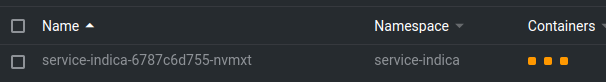
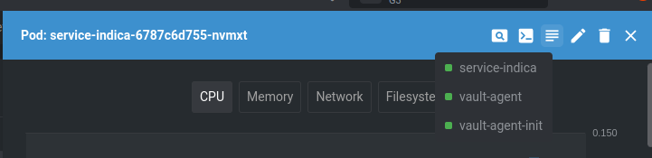
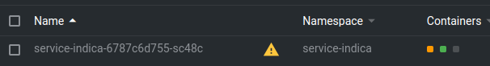
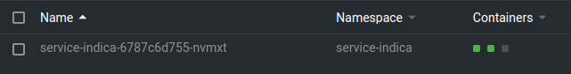

## Como atuar quando os pods das aplicações não consegue se autenticar com o Vault

Um problema que ainda não foi 100% solucionado ocorre quando um nó do kubernetes que um dos pods `vault-<n>` está ligado fica indisponível. Por razões ainda desconhecidas, quando o problema descrito ocorre pode acontecer das aplicações não conseguirem mais se autenticar no Vault. Esse problema pode ser identificado no Lens quando os 3 containers contidos no pod de uma aplicação ficam com a cor laranja e não mudam nunca de status/cor, conforme a imagem abaixo:



Ao notar esse comportamento, podemos confirmar se o problema é mesmo de autenticação conferindo o log do container `vault-agent-init` (a mensagem no log indicará o problema) que é criado junto com o pod da aplicação, conforme a imagem abaixo:



A resolução desse problema envolve abrir um shell para um dos pods vault (vault-0 ou vault-1) e executar um comando para atualizar a configuração de autenticação entre o Vault e o cluster kubernetes.

1. Após abrir um shell para o pod do vault, é necessário fazer login no cofre de senhas utilizando o `root token`. Esse token pode ser obtido no Parameter Store da AWS (no caso do cluster EKS) a partir da chave `/dev/vault_cluster_keys`. O valor contido nesse parâmetro é um json e o root token pode ser encontrado no campo `root_token`. Com o root token em mãos, execute o comando `vault login` no shell do vault e insira o token.

2. Após fazer o login execute o seguinte comando para sobreescrever a configuração de autenticação entre o Vault e o cluster Kubernetes:

```
vault write auth/kubernetes/config \
        token_reviewer_jwt="$(cat /var/run/secrets/kubernetes.io/serviceaccount/token)" \
        kubernetes_host="https://$KUBERNETES_SERVICE_HOST:$KUBERNETES_SERVICE_PORT" \
        kubernetes_ca_cert=@/var/run/secrets/kubernetes.io/serviceaccount/ca.crt
```

3. Após executar o comando anterior reinicie as aplicações que estavam com erro de autenticação com o Vault. Se tudo ocorrer bem o container `vault-agent-init` conseguirá se autenticar com o vault e em seguida terminará sua execução (como pode ser visto pela cor cinza do container). Já os demais containers deverão mudar para a cor verde. O container da aplicação é o último a ficar verde pois é o processo que leva mais tempo para subir.



4. No final do processo o pod da aplicação deve ficar dessa forma:



Observação: Nem todas as aplicações possuem integração com o Vault, como é o caso do `service-lead`, `service-lite` e aplicações frontend, por exemplo. Essas aplicações não são afetadas em caso de indisponibilidade do Vault.